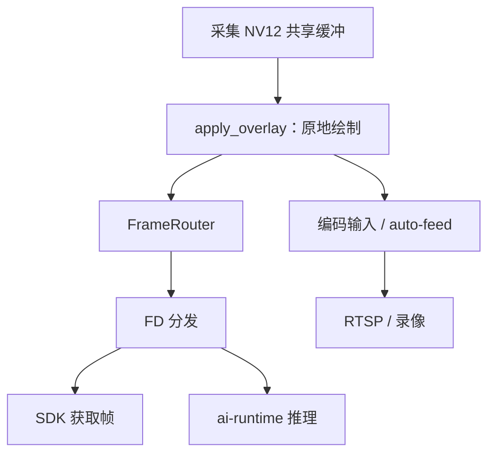
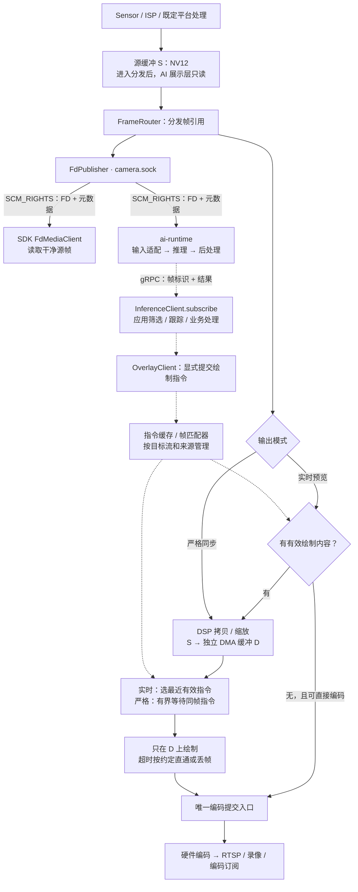
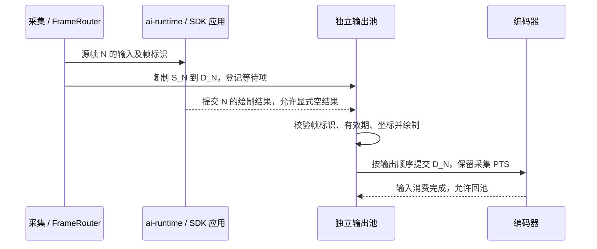

# 视频 FD 数据流优化：独立输出缓冲与 AI Overlay 帧同步

日期：2026-09-10  
状态：设计草案，整理自本次讨论；本文不代表方案已实现或已通过设备验收。  
范围：camera-daemon、ai-runtime、HAL / MediaLibrary、Python / C++ SDK。

源码核对基线：SDK HEAD `1bf65bc`、平台 HEAD `b9eb5de0`，包括核对时的工作区修改，因此不是两个提交本身的发布能力清单。设备数据引用已有测试记录，本次整理未重新进行设备测试。

## 1. 方案概述

建议由 camera-daemon 维护一个独立的、硬件可访问的输出帧缓冲池：采集帧用于 FD 分发和推理，AI Overlay 只修改输出缓冲，处理完成后再送入硬件编码器。

需要分别解决三个问题：

1. **图像隔离**：绘制不能修改 SDK 和 ai-runtime 正在读取的源帧。
2. **行为隔离**：订阅推理结果不应默认改变视频画面；绘制由应用显式提交，或由显式配置的平台绑定触发。
3. **帧同步**：严格同步需要帧标识、结果匹配、有界等待和编码顺序控制；仅增加输出缓冲不能保证框与画面同帧。

独立缓冲仍可使用 DMA-BUF、DSP 和硬件编码。代价主要是额外的媒体内存、像素搬运和调度开销，不能将其描述为“完全零拷贝”或“零 CPU”。

## 2. 当前实现及问题

### 2.1 SDK 的订阅输出

| 接口 | 当前输出 | 是否包含视频像素 |
|---|---|---|
| `InferenceClient.subscribe(stream, model, ...)` | `(frame_sequence, InferenceResult)`；启动服务端流式推理 | 不包含输入图像；原始模型张量可出现在 `raw_outputs` |
| `FdMediaClient.subscribe(stream, ...)` | `Frame`；默认读取并复制像素，`keep_fd=True` 保留 `FrameHandle` | 有，或持有可访问像素的 DMA 缓冲句柄 |
| `EncodedStreamClient.subscribe()` | `EncodedFrame`，包含编码数据、PTS/DTS、关键帧标志等 | 包含压缩后的 H.264/H.265 数据 |
| `EventClient.subscribe(topic, ...)` | `Event`，包含 topic、payload、metadata 等 | 推理事件通常只包含结果 |

以上 Python 返回值可在 [inference.py][sdk-inference]、[inference_types.py][sdk-types]、[fd_client.py][sdk-fd]、[encoded.py][sdk-encoded] 和 [events.py][sdk-events] 中核对。

### 2.2 Overlay 在 FD 分发前修改共享帧



`handle_video_frame_for_routing()` 先调用 `apply_overlay()`，再调用 `frame_router_->on_frame_arrived()`；frontend bridge 在回调结束后继续把同一底层缓冲送给编码器。[源码：绘制点][camera-daemon]、[源码：auto-feed][frontend-bridge]

因此，同一路流的 SDK 和 ai-runtime 都可能收到已经带框、文字或 AI 马赛克的画面。第 N 帧的推理结果还可能画到后续帧，再进入下一次推理，形成展示内容污染推理输入的反馈。

以下方法不能独立解决这个问题：

- **仅将绘制移动到 FD 发送之后**：FD 仍指向同一块内存，读取和绘制可能并发发生。
- **仅 `dup(fd)`**：增加的是句柄引用，没有创建独立像素存储。
- **仅配置 `sub → main`**：当前 `apply_overlay()` 优先查同名流结果，再查 `stream_map`；映射不是严格的绘制目标白名单。[源码：结果匹配][overlay-subscriber]

本文的“干净源帧”专指不被 AI 展示层修改，不承诺没有 ISP 或平台既定的隐私处理。现有 DPM、隐私遮挡和注入路径的处理边界必须在迁移时保留并核对，不能因新增直通分支绕过它们。

### 2.3 推理与自动绘制存在隐含耦合

当前 `StreamInfer` 在 `event_bus_auto_publish` 开启且存在后处理结果时，会发布推理事件。仓库配置默认开启自动发布，camera-daemon 的 Overlay 订阅者消费相应事件后绘制。[服务端发布][runtime-grpc]、[默认配置][runtime-config]

因此，应用仅开始消费 `subscribe()`，也可能触发视频带框。如果应用筛选结果后又调用 `annotate_result()`，服务端原结果和应用结果会进入同一按流缓存，可能重复发布或相互覆盖。

这不意味着必须删除 event-bus。需要解除的是“普通推理事件自动成为绘制指令”的默认关系，而不是取消所有结果广播。

### 2.4 当前没有严格对帧

`annotate_result()` 目前提取结果内容，但没有把原始 `frame_sequence`、采集时间传入绘制事件。平台按流保留最新结果，并按事件接收后的时间判断过期。[SDK 发布实现][sdk-overlay]、[平台缓存实现][overlay-subscriber]

当前 TTL 已支持事件、流、全局配置及按显示流帧率推导的优先级，不能继续把它概括为固定 500 ms。即便可配置，接收时间 TTL 也不能识别在 SDK 队列中积压很久才提交的结果。

### 2.5 当前 HAL 绘制不等于 DSP 绘制

核对到的 Hailo15 AI Overlay 路径使用 `HailoNV12Mat`，检测框调用 `draw_rectangle_opencv()`，文字、马赛克等也存在 CPU 路径。它避免了全帧转 BGR，但不能据此称为 DSP 绘制或零 CPU。[HAL 绘制实现][hal-draw]

## 3. 优化后的数据流



实线表示帧引用、像素或编码数据，虚线表示结果和指令。图中是目标结构，严格同步的等待、独立输出缓冲和编码提交切换尚需实现。

关键约束：

- **S 与 D 不得别名到同一块存储**，AI Overlay 永远不写 S。
- 无绘制内容且无需其他像素处理时，实时分支可直接编码 S，避免无意义复制。若下游 OSD 或编码前处理会原地修改输入，也必须使用 D 或证明其内部已隔离，不能只检查 AI 框是否为空。
- 严格同步在 D 上等待，避免为了等待应用结果而额外长期扣留采集池；复制任务完成前仍须持有 S。
- DSP、CPU 绘制与编码依次取得 D 的读写使用权，未完成的异步任务不能与回池、重写并发。
- frontend 回调只做有界的接收和调度，不在采集线程等待推理或应用回复。
- 每路视频只有一个编码提交入口，避免原 auto-feed 提交 S，同时新路径又提交 D。

## 4. 缓冲池与所有权

### 4.1 两类缓冲

| 缓冲 | 所有者 | 用途 | 回收条件 |
|---|---|---|---|
| 源缓冲 `S_N` | HAL / 采集池 | FD 只读分发、推理输入、输出复制源，或无修改的直接编码 | 所有读者及相关硬件任务完成后归还 |
| 输出缓冲 `D_N` | camera-daemon 输出池 | 等待结果、绘制、编码 | 编码输入消费完成且无在途任务后归还 |

输出池建议通过 HAL `request_frame_buffer()` / MediaLibraryBufferPool 创建，使用 NV12、`HAL_MEM_DMABUF`，保留完整的 native buffer 包装、布局信息及释放回调。不能仅拼出一个 FD 就假定它可被所有下游接受。[分配实现][hal-pool]

### 4.2 生命周期

建议状态顺序：

```text
FREE → COPYING → WAIT_RESULT（仅严格模式）→ DRAWING → ENCODING → FREE
```

实时模式跳过等待；无绘制时可以跳过 DRAWING。失败、超时和停流都必须进入显式清理流程：停止接收新任务，丢弃尚未提交的工作，并在硬件结束访问后回收缓冲。

客户端关闭或租约到期不等于 DSP、编码器已经停止访问内存。不能仅因超时就把仍被硬件使用的缓冲交给下一帧，也不能用 watchdog 强制复用来满足“源帧稳定”的承诺。

跨进程句柄经 `SCM_RIGHTS` 或已注册的 `buffer_id` 传递；裸 FD 数字不能通过 gRPC 直接当成另一进程的有效句柄。`dup()` 保留 FD 引用也不自动延长 camera-daemon 对该帧内容的租约。

## 5. 实时预览与严格同步

| 项目 | 实时预览，建议默认 | 严格同步，显式开启 |
|---|---|---|
| 结果选择 | 本帧可用的最近有效结果 | 同一采集帧的结果 |
| 是否等待推理 | 不等待 | 在限定期限内等待 |
| 框与画面关系 | 允许可观测的时间偏差 | 有框的帧必须匹配自身结果 |
| 缓冲成本 | 主要覆盖复制、绘制和编码在途帧 | 还需覆盖结果等待队列 |
| 无结果 | 输出无 AI 标注帧 | 按配置输出无 AI 标注帧或丢弃；记录降级 |
| 适用场景 | 低延迟预览 | 对帧精度要求高的标注、取证或分析输出 |

### 5.1 严格同步流程



帧标识至少包含 `stream_id + stream_epoch + frame_sequence`；epoch 在重启、切换分辨率或重建流时变化，防止旧结果匹配到复用的序号。还需保留采集时间、时钟域，以及目标流与源流的关系。

跨 sub/main 流优先使用共同采集标识；只有时间戳时，需要已校准的时钟关系和明确容差。无法证明对应同一次采集时，只能承诺时间近似对齐，不能宣称严格同帧。

必须明确以下行为：

- **空结果与未返回不同**：`objects=[]` 可表示该帧推理已完成且没有目标，应结束等待。
- **结果乱序**：N+1 先完成不能直接越过尚未处理的 N；按采集顺序提交，或按已声明规则丢弃阻塞帧。
- **结果迟到**：帧已编码、丢弃或跨 epoch 后，拒绝该结果，不能改画到下一帧。
- **超时 / 队列满**：期限和队列深度均有上限；首版建议超时输出无 AI 标注帧并计数，要求每张输出都有结果的任务可选择丢帧。平台既有隐私处理仍须执行。
- **推理与视频帧率不同**：30 fps 视频配 10 fps 推理时，未推理帧没有同帧结果。必须选择只输出被选中的帧，或让其他帧无 AI 标注；复用最近结果属于实时模式。
- **多个结果来源**：提前声明本帧需要等待哪些来源；静态区域等持久图层不应被当成逐帧推理完成条件。

## 6. 绘制指令与 SDK 边界

### 6.1 目标行为

- `InferenceClient.subscribe()` 保持返回推理结果的职责，不默认启用绘制。
- `OverlayClient` 保留配置和显式提交绘制内容的职责；SDK 不负责分配整帧输出池，也不必搬运像素。
- 平台自动带框仍可提供，但须显式绑定推理来源、目标流、筛选规则和同步模式。
- 普通推理事件可以继续广播给业务消费者，绘制只消费明确的 Overlay 指令或显式绑定后的结果。

传输可继续使用 event-bus，例如独立的 `overlay/...` 命名空间；也可采用专用 RPC。本文先固定语义，不把更换传输层作为前置条件。示意 topic、字段和绑定操作均为拟议契约，不是已存在的 SDK API。

### 6.2 指令应携带的字段

| 字段组 | 目的 |
|---|---|
| `session_id / source_id / command_id` | 来源隔离、重复指令识别和会话清理 |
| `source_stream / target_stream / stream_epoch` | 明确读哪路、画哪路，拒绝旧配置结果 |
| `frame_sequence / capture_id / capture_timestamp / clock_domain` | 同帧匹配、跨流关联和新鲜度判断 |
| `coordinate_space / transform / geometry_version` | 说明坐标相对源图、模型输入还是目标图，处理裁剪、缩放、letterbox 和旋转 |
| `shapes / result_complete` | 实际绘制内容，区分空结果和未完成 |
| `mode / validity / deadline` | 区分最近结果和同帧结果，限制陈旧指令及等待时间 |

归一化坐标能表达尺寸比例，但不能自动补偿不同视野、裁剪和 letterbox。源流到目标流必须有明确变换。

实时结果的新鲜度应基于采集时间或同一时钟域下可验证的采集年龄；缓存接收时间单独用于资源清理，不能给迟到结果重新延长有效期。逐帧结果与静态区域图层分别定义有效期。

同一目标流按 `(session_id, source_id)` 管理图层，定义稳定的合成顺序。应用过滤后的结果不应被平台原结果覆盖；同一来源的“平台自动模式”和“应用处理模式”必须显式选择，不能双写。

### 6.3 兼容迁移

不要直接关闭全局 event-bus 自动发布而影响其他业务。先引入独立绘制通道及显式绑定，为旧部署提供可配置的 legacy 自动绑定，避免升级后无提示地改变视频表现；新会话默认无隐式绘制。

旧 `annotate_result()` 缺少完整帧关联，只能继续提供实时语义，直到补充契约。Python 与 C++ 应对齐支持范围；目前 C++ OverlayClient 主要提供配置接口，不能假定它已具备 Python 的内容提交能力。[Python Overlay][sdk-overlay]、[C++ Overlay][cpp-overlay]

## 7. 独立缓冲如何使用 DSP 与编码硬件

### 7.1 可用条件

| 条件 | 要求 |
|---|---|
| 分配器 | 使用驱动可访问的媒体 DMA 内存；普通 `malloc`、numpy 或 `memfd` 不等同 DMA-BUF |
| 布局 | 提供真实的 plane 数、FD、stride、size，满足格式和硬件对齐约束，不自行猜测 stride |
| 权限与所有权 | 源 S 只读；输出 D 由平台管理并独占写入；当前 DSP 服务禁止导入帧作为普通写入目标 |
| 算子 | 当前 RESIZE 源/目标格式一致；BLEND 底图 NV12、图层 ARGB32，并原地修改底图 |
| 同步 | 等复制完成再绘制，等绘制完成再编码；CPU 访问须执行平台支持的缓存同步，任务完成通知不能随意等同缓存维护 |
| 编码兼容 | D 的格式、尺寸、布局和 native buffer 包装被编码器接受，编码消费结束前保持其引用 |
| 资源 | 媒体池余量、调度容量和配额满足整条流水线，不能仅查看普通内存或总 CmaFree |

现有 HAL 同时有 DMA-BUF 和部分 USERPTR 输入路径，因此“普通内存绝对不能用 DSP”也不准确；但 USERPTR 可能引入映射、暂存和复制成本，不是本方案的优先路径。[DSP 帧描述][hal-dsp]、[服务端校验][dsp-service]

### 7.2 搬运与绘制是两个步骤

推荐先复用 DMA-BUF 到 DMA-BUF 的 RESIZE；不改变尺寸时以 1:1 RESIZE 作为复制候选。已有记录验证过 4K 1:1 操作的像素一致性，但不代表目标设备上已满足持续帧率。[DSP 记录][dsp-proposal]

绘制实现分两步落地：

1. **先完成隔离**：在 D 上复用现有 NV12 CPU 绘制，测量框、文字、马赛克的实际成本。
2. **再优化合成**：CPU 将框和文字栅格化成尽可能小的透明图层，DSP BLEND 到 D；静态图层缓存复用。现有 BLEND 并不直接接受“画框、写字”的语义指令。

ARGB32 是 HAL 格式名，具体字节顺序和 alpha 规则以 HAL / vendor 协议为准，不能仅凭名称推断。当前非 DMA 图层存在 HAL 暂存到 DMA heap 的路径，会产生 CPU 复制和分配成本；优化时应复用可访问的图层缓冲。[BLEND 实现][hal-dsp]

### 7.3 硬件链的当前验证边界

| 能力 | 已核对状态 |
|---|---|
| 平台分配独立 NV12 DMA 缓冲 | 已有 HAL / MediaLibraryBufferPool 实现 |
| 采集 DMA 源 → 独立池 RESIZE | 已有实现及设备验证记录，包括 4K 1:1 像素一致 |
| RESIZE 后 BLEND | 2026-09-07 有挂死记录；2026-09-08 更换 HAL 构建、媒体池有余量时 11/11 通过；原因仍未完全定位，SDK 默认限制保留 |
| 当前 AI Overlay 全部由 DSP 绘制 | 不成立，核对到的路径仍有 CPU 栅格化 |
| D 直接接入视频编码并保护 S | 本方案待实现及验证，不由前几项自动推出 |

不能把短时单算子测试结果当成“4K30 整条流水线已经可用”，也不能把历史挂死概括为独立缓冲必然不能使用 DSP。[历史与复测][dsp-proposal]

### 7.4 编码提交必须一起改

当前 frontend bridge 在回调结束后执行 `add_buffer(buf)`，`buf` 仍是原采集缓冲。必须提供一个能提交 S 或 D 的统一输出入口：保持原 PTS、正确持有 native buffer、等待像素处理完成，并关闭受影响流的重复 auto-feed。[当前提交点][frontend-bridge]

现有 PushFrame P0 的实现记录是“把外部帧内容复制回原 pipeline buffer”；记录也明确保留了直接 buffer swap 的后续工作。因此它可以提供接入经验，但不能直接作为源帧隔离已经完成的证据。[注入现状][injection-proposal]

停止、重启或切换分辨率时，停止旧入口、处理在途任务、使旧 epoch 指令失效，再切换缓冲池。禁止把不同尺寸或尚未绘制完成的 D 送入编码器。

## 8. 内存、CPU、带宽和调度预算

NV12 紧致存储估算：`frame_bytes = width × height × 1.5`。以下使用十进制 MB，不含平面对齐、图层、编码池和其他工作缓冲。

| 分辨率 | 单帧 | 3 帧输出池示例 | 30 fps 每帧复制一次的理论读＋写量 |
|---|---:|---:|---:|
| 1920×1080 | 3.1104 MB | 9.3312 MB | 186.624 MB/s |
| 3840×2160 | 12.4416 MB | 37.3248 MB | 746.496 MB/s |

这不是 CPU 占用率或整机实测 DDR 带宽。DSP 可以降低 CPU 搬运成本，但像素读写仍然存在；CPU 图层生成、同步、调度及 fallback 也要计入。

“3 帧池”只是内存示例，不是足够满足严格同步的固定配置。初步估算：

```text
等待槽数 ≈ ceil(等待帧率 × 最大等待秒数)
总输出槽数 ≥ 等待槽数 + 复制/绘制在途槽数 + 编码持有槽数 + 余量
```

例如 30 fps、100 ms 等待窗口，仅等待阶段就可能需要 3 帧，再加硬件在途缓冲。最终深度需要通过延迟分布和实际编码引用周期验证，并受媒体池预算约束。

当前应用 DSP 服务的默认限制包括 120 MPix/s（源加目标计费）和 16,777,216 个未归还目标像素。4K30 的一次完整复制就约为 `3840 × 2160 × 2 × 30 = 497.664 MPix/s`，3 个 4K 目标缓冲也会超过默认目标像素额度。[配额定义][dsp-config]、[计费实现][dsp-service]

这是应用服务的默认配额，不是 DSP 硬件峰值。平台输出任务应有经过测量的独立预算，并与 ISP/DPM/其他 DSP 工作协调；不能直接扩大所有应用配额，也不能因平台内部可能绕过应用服务就忽略硬件竞争。

## 9. 分阶段实施

| 阶段 | 工作内容 | 完成条件 |
|---|---|---|
| P0：源帧隔离 | 独立 NV12 DMA 池、明确目标流、统一编码提交、现有绘制只写 D；优先接入已验证的 DSP 复制路径 | 同一路 FD / 推理输入不含 AI 标注，编码输出带标注；auto-feed 与手动路径均无重复提交 |
| P1：结果与显示解耦 | 独立绘制指令契约、来源隔离、实时有效期、显式自动绑定、legacy 迁移 | 仅订阅结果不会隐式绘制；应用过滤结果不被自动结果覆盖 |
| P2：严格对帧 | epoch / capture 标识、有界帧队列、显式空结果、超时和乱序策略、坐标变换 | 正常结果严格匹配输出帧；迟到结果拒绝；延迟和内存有上界 |
| P3：降低 CPU 与持续运行验证 | 图层缓存、DSP BLEND 稳定性、媒体池及调度优化、多路输出压力测试 | 在选定分辨率和帧率下达到约定 CPU、延迟和稳定性指标 |

P0/P1 是同一设计落地的基础工作；不应把“新增缓冲池”单独宣布为整项完成。严格同步和 DSP 全面合成可分别开启，不要求第一版同时具备。

## 10. 验收与可观测性

| 验证项 | 方法与预期 |
|---|---|
| 源帧隔离 | 固定测试图或同一保留帧，绘制前后比较 S 的像素；SDK 和 ai-runtime 都读取 S；编码输出能看到 D 上的标注 |
| 所有权 | 覆盖慢客户端、断连、DSP 在途、编码延迟；确认没有提前回池、FD 泄漏、重复释放或活动缓冲复用 |
| 订阅无隐式绘制 | 新模式下仅启动 `subscribe()`；推理结果正常返回，画面不因该订阅改变；显式提交后出现标注 |
| 来源隔离 | 平台结果与应用过滤结果并发，验证只有已选来源生效，不互相清空或覆盖 |
| 帧同步 | 输入画面嵌入采集序号；人为延迟、乱序、丢失结果，在编码解码后核对可见序号与所用结果 |
| 空结果与迟到 | 空结果结束等待且无框；已输出帧的迟到结果不会出现在后续帧 |
| 跨流与坐标 | 同帧标识可追溯；不同尺寸、裁剪、letterbox、旋转下框位置正确；无法精确关联时不报告严格同步成功 |
| 路由与编码 | 同名结果不能绕过目标流白名单；检查 auto-feed / 手动模式、PTS 顺序、切流和码流连续性 |
| 性能与压力 | 分别测无绘制、CPU 绘制、DSP 合成、实时和严格模式；覆盖目标分辨率、帧率、图层数量及媒体内存压力 |

建议每流暴露以下指标，而不是只报告“画框成功”：

- 输出池占用、峰值、分配失败、队列丢帧、等待超时、迟到和重复指令数。
- 复制、绘制、等待和编码提交延迟的 p50 / p95 / p99，以及实际 FPS。
- 本帧使用的结果标识；`skew = 输出帧采集时间 − 结果对应的采集时间`，仅在可比较的时钟域计算。
- 分进程 CPU、DSP 队列等待、媒体池用量及软件 fallback 次数。
- 严格同步的无标注降级数，避免把持续超时直通误报成同步达标。

性能阈值在目标设备基线测量后填写，不预先承诺固定 CPU 百分比或 4K30 吞吐。

## 11. 与现有提案的关系

- [composable-pipeline-contracts.md](composable-pipeline-contracts.md)：本文细化其中“源帧不被展示层修改、输出分支合成、实时与严格模式”的契约。
- [ai-overlay-extended.md](ai-overlay-extended.md)：复用形状、轨迹和来源隔离的方向；本文补充绘制位置、帧标识和输出生命周期。
- [dsp-offload.md](dsp-offload.md)：复用硬件分配、导入和任务能力，同时保留其设备限制与复测结论。
- [frame-injection.md](frame-injection.md)：共享编码输入切换与引用管理需求；复制回原 pipeline buffer 不满足本文的隔离目标。

部分旧提案仍描述固定 TTL、源流映射即可保持干净或尚未落地的全部功能；评估本方案现状时，应以本文引用的当前代码和有日期的测试记录为准，不据此改写历史测试结论。

## 12. 源码与证据索引

SDK 链接位于本仓库；平台链接假设 `ne503-aipc` 与本仓库处于同一父目录。函数名用于辅助定位，行号可能随工作区变化。

| 证据 | 主要定位 |
|---|---|
| [SDK 推理订阅][sdk-inference] / [结果类型][sdk-types] | `InferenceClient.subscribe`、`InferenceResult` |
| [SDK 原始帧][sdk-fd] / [编码帧][sdk-encoded] / [事件][sdk-events] | 各 Client 的 `subscribe` 与帧类型 |
| [Python Overlay][sdk-overlay] / [C++ Overlay][cpp-overlay] | `annotate_result`、`_publish_overlay_event`、`OverlayClient` |
| [平台绘制位置][camera-daemon] | `handle_video_frame_for_routing` |
| [Overlay 匹配和有效期][overlay-subscriber] | `apply_overlay`、`resolve_result_ttl_ms`、结果接收缓存 |
| [推理服务端][runtime-grpc] / [配置][runtime-config] | `StreamInfer`、`publish_result`、`auto_publish_results` |
| [编码 frontend bridge][frontend-bridge] | 回调之后的 `add_buffer(buf)` |
| [HAL 缓冲池][hal-pool] | `hailo15_get_or_create_pool`、`hailo15_frame_buffer_request` |
| [DSP 服务][dsp-service] / [配额][dsp-config] | 分配/导入、BLEND 写入约束、像素计费 |
| [DSP HAL][hal-dsp] / [绘制 HAL][hal-draw] | `hal_frame_to_dsp_image`、RESIZE/BLEND、`draw_rectangle_opencv` |
| [DSP 历史及复测][dsp-proposal] / [注入现状][injection-proposal] | 4K 1:1 RESIZE、9/7 挂死与 9/8 复测、PushFrame P0 状态 |

[sdk-inference]: ../../python/neoruntime_ipc_sdk/inference.py
[sdk-types]: ../../python/neoruntime_ipc_sdk/inference_types.py
[sdk-fd]: ../../python/neoruntime_ipc_sdk/fd_client.py
[sdk-encoded]: ../../python/neoruntime_ipc_sdk/encoded.py
[sdk-events]: ../../python/neoruntime_ipc_sdk/events.py
[sdk-overlay]: ../../python/neoruntime_ipc_sdk/overlay.py
[cpp-overlay]: ../../cpp/include/neoruntime_ipc_sdk/overlay.hpp
[camera-daemon]: ../../../ne503-aipc/platform/camera-daemon/src/camera_daemon.cpp
[overlay-subscriber]: ../../../ne503-aipc/platform/camera-daemon/src/ai_overlay_subscriber.cpp
[runtime-grpc]: ../../../ne503-aipc/platform/ai-runtime/src/grpc_service.cpp
[runtime-config]: ../../../ne503-aipc/configs/ai/ai-runtime.yaml
[frontend-bridge]: ../../../ne503-aipc/hal_v2/platforms/hailo15/media/hailo15_ml_frontend_bridge.cpp
[hal-pool]: ../../../ne503-aipc/hal_v2/platforms/hailo15/media/hailo15_media_impl.cpp
[dsp-service]: ../../../ne503-aipc/platform/camera-daemon/src/dsp_service.cpp
[dsp-config]: ../../../ne503-aipc/platform/camera-daemon/include/dsp_service.h
[hal-dsp]: ../../../ne503-aipc/hal_v2/platforms/hailo15/dsp/hailo15_dsp_impl.cpp
[hal-draw]: ../../../ne503-aipc/hal_v2/platforms/hailo15/model/hal_draw_hailo15.cpp
[dsp-proposal]: dsp-offload.md
[injection-proposal]: frame-injection.md
